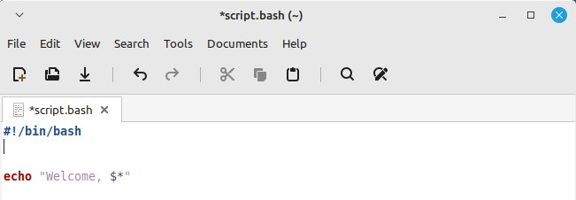
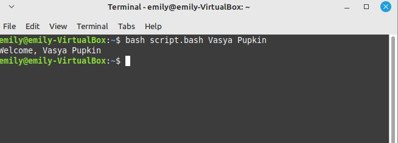

# лабораторная работа 1
## Цель
Цель данного проекта — создать Bash-скрипт, который принимает два и более аргументов (имя и фамилию) и выводит приветственное сообщение.

## Шаги выполнения

1. **Создание файла скрипта**
   - я создала файл с именем script.bash в текстовом редакторе в виртуальной машине. 
   
   ___bash__ (Bourne again shell) - усовершенствованная оболочка (shell/интерпретатор команд) sh, появившаяся в 1989 году._
   - _набор команд называется __программа или скрипт___
   - я вписала в него ___шебанг___ ```#!/bin/bash```_(указывает операционной системе, какой интерпретатор нужно использовать для выполнения скрипта.)_
   - кроме того, я вписала команду ```echo "..."``` - _команда оболочки bash, выводящая содерджимое кавычек_
   - внутри кавычек я написала ```"Welcome, $*"```. _значок __$__ используется для вызова содержимого переменной._
2. **Запуск bash-скрипта в терминале**
   - я открыла терминал линукс и вписала в него следующую команду: ```bash script.bash Vasya Pupkin```.
    
    ___bash__ - обозначение оболочки, в которой я буду производить действия. __script.bash__ - вызов моего файла по имени. __Vasya Pupkin__ - аргументы, которые мне необходимо взвать в результате выполнения команды_ 
   - я получила искомый вывод ```Welcome, Vasya Pupkin```. _рассмотрим зарезервированную переменную __$*__ - выводит в строку все аргументы, переданные скрипту._
